# sql_query

# Создание баз данных для разных предметных областей

Задача этого проекта - реализовать хранение данных в базах данных с помощью sql-запросов для 4 предметных областей:

- библиотека
- ресторан
- учебное заведение
- фитнес-центр

## Требования

Для каждой из предметных областей нужно:

1. Создать таблицу с объектами, атрибутами и ограничениями каждого из атрибутов

2. Нарисовать ER-диаграмму

3. Написать sql-запросы

## Библиотека

### Таблица с объектами и атрибутами

|Таблица   | Атрибуты        | Ограничения                      |
|----------|-----------------|----------------------------------|
|книги     | id              | только числа, авто инкремент     |
|          |название         |  строка не более 50 символов     |
|          | автор           |строка не более 50 символов       |
|          | год издания     |  число больше чем 0              |
|          | жанр            |  строка не более 50 символов     |
|          | статус наличия  |  строка не более 50 символов     |
|          | обложка          |  строка не более 50 символов    |
||        ||                 ||                                ||
| читатели | id              | только числа, авто инкремент     |
|          | имя             |  строка не более 50 символов     |
|          | фамилия         | строка не более 50 символов      |
|          | дата рождения   | формат даты: ГГГГ-ММ-ДД          |
|          | адрес           | строка не более 150 символов     |
|          | телефон         | строка строго 11 символов        |
||        ||                 ||                                ||
| выдача   |  id             | только числа, авто инкремент     |
|          | id книги        | только числа, ссылка             | 
|          | id читателя     | только числа, ссылка             |
|          | дата выдачи     | формат даты: ГГГГ-ММ-ДД          |
|          | дата возврата   | формат даты: ГГГГ-ММ-ДД          |

### ER-диаграмма библиотеки

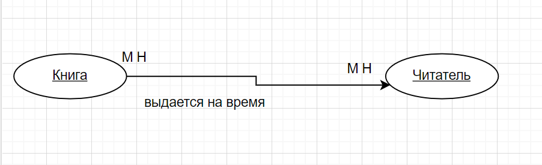

Таблица для учета выдачи книг не является сущностью, это просто соответсятвие книги и читателя так как между ними связь много ко многому.

Книга и читатель могут существовать друг без друга.

### SQL-запросы

#### Таблица с книгами

1. Создание таблицы для книг

```sql
CREATE TABLE books (
	id SERIAL PRIMARY KEY,
	name VARCHAR(50),
	author VARCHAR(50),
	year INTEGER,
	janr VARCHAR(50),
	status VARCHAR(50)
);

ALTER TABLE books
ADD COLUMN cover VARCHAR(50)
```
2. Добавление экземпляров и просмотр результата

```sql
INSERT INTO books (name, author, year, janr, status, cover) VALUES ('Война и мир', 'Лев Толстой', 1867, 'роман', 'В наличии', 'бумажная');

INSERT INTO books (name, author, year, janr, status, cover) VALUES ('Белые ночи', 'Достоевский', 1848, 'повесть', 'Нет на складе', 'картонная');

INSERT INTO books (name, author, year, janr, status, cover) VALUES ('Мастер и Маргарита', 'Булгаков', 1940, 'роман', 'В наличии', 'кожаная');


SELECT * FROM books
```

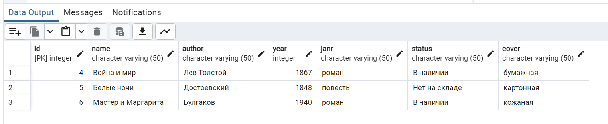

#### Таблица с читателями

1. Создание таблицы для читателей

```sql
CREATE TABLE readers (
	id SERIAL PRIMARY KEY,
	name VARCHAR(50),
	surname VARCHAR(50),
	birth DATE,
	addres VARCHAR(150)
);

ALTER TABLE readers
ADD COLUMN phone CHAR(11)
```
2. Добавление экземпляров и просмотр результата

```sql
INSERT INTO readers (name, surname, birth, addres, phone) VALUES ('Ivan', 'Ivanov', '1990-01-01', 'Moscow', '89135553535');

INSERT INTO readers (name, surname, birth, addres, phone) VALUES ('Petr', 'Petrov', '1990-01-01', 'Moscow', '89536783535');

INSERT INTO readers (name, surname, birth, addres, phone) VALUES ('Sidor', 'Sidorov', '1990-01-01', 'Moscow', '89055553429');


SELECT * FROM readers
```

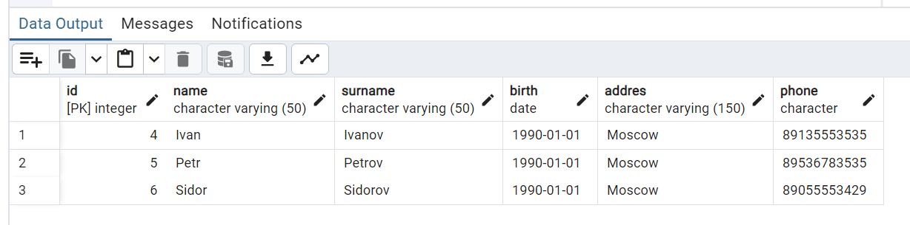

#### Таблица с учетом выдачи книг

1. Создание таблицы для чучета выдачи книг

```sql
CREATE TABLE book_out (
	id SERIAL PRIMARY KEY,
	id_book INTEGER,
	id_reader INTEGER,
	date_out date,
	date_retutn date,
	FOREIGN KEY (id_reader) REFERENCES readers(id),
	FOREIGN KEY (id_book) REFERENCES books(id)
);
```
2. Добавление экземпляров и просмотр результата

```sql
INSERT INTO book_out (date_out, date_retutn) VALUES ('2020-01-01', '2020-01-03');

INSERT INTO book_out (date_out, date_retutn) VALUES ('2020-02-06', '2020-02-19');

INSERT INTO book_out (date_out, date_retutn) VALUES ('2020-03-08', '2020-03-16');


SELECT * FROM book_out
```
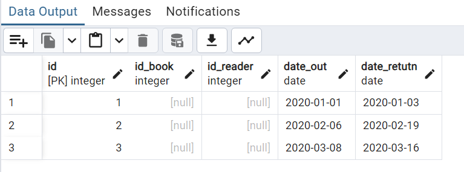

## Ресторан

### Таблица с объектами и атрибутами

|Таблица   | Атрибуты        | Ограничения                      |
|----------|-----------------|----------------------------------|
| клиент   | id              | только числа, авто инкремент     |
|          |имя              |  строка не более 50 символов     |
|          | фамилия         |строка не более 50 символов       |
||        ||                 ||                                ||
| меню     | id              | только числа, авто инкремент     |
|          | название        |  строка не более 50 символов     |
|          | описание        | строка не более 200 символов     |
|          | цена            | число больше чем 0               |
|          | категория       |строка не более 50 символов       |
|          | картинка        |двоичные данные                   |
||        ||                 ||                                ||
| заказы   | id              | только числа, авто инкремент     |
|          | дата оформления | формат даты: ГГГГ-ММ-ДД ЧЧ:ММ:СС |
|          | id клиента      | только числа, ссылка             |
|          | статус          | строка не более 30 символов      |
|          | комментарий     |строка не более 200 символов      |
||        ||                 ||                                ||
| позиции  | id              | только числа, авто инкремент     |
|          | id заказа       |  только числа, ссылка            |
|          | id меню         | только числа, ссылка             |
|          | количество      | число больше чем 0               |

### ER-диаграмма ресторана

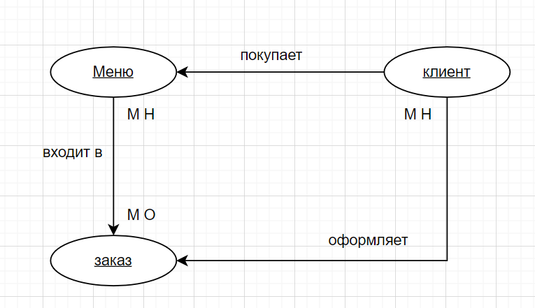

Позиция не является сущностью, это таблица соответсятвия заказа и блюда, так как между ними связь много ко многому. 

Заказ в свою очередь тоже соответсвие клиента и блюда, так как между ними тоже связь много ко многому.

Клиент и блюдо могут существовать сами по себе, а заказ без клиента и блюда не может.

### SQL-запросы

#### Таблица с блюдами

1. Создание таблицы для блюд

```sql
CREATE TABLE menu (
	id SERIAL PRIMARY KEY,
	name VARCHAR(50),
	description VARCHAR(200),
	price INTEGER,
	category VARCHAR(50)
);

ALTER TABLE menu
ADD COLUMN image bytea
```
2. Добавление экземпляров и просмотр результата

```sql

INSERT INTO menu (name, description, price, category, image) VALUES ('salad', 'salad with meat', 100, 'salads', 'salad.jfif');

INSERT INTO menu (name, description, price, category, image) VALUES ('pasta', 'pasta with meat', 200, 'pasta', 'pasta.jfif');

INSERT INTO menu (name, description, price, category, image) VALUES ('soup', 'soup with meat', 300, 'soup', 'soup.jfif');

SELECT * FROM menu
```
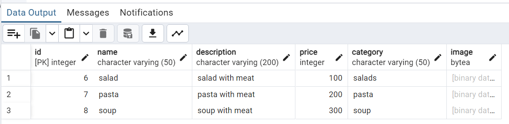

#### Таблица с клиентами

1. Создание таблицы для клиентов

```sql
CREATE TABLE client (
	id SERIAL PRIMARY KEY,
	name VARCHAR(30),
	surname VARCHAR(30)
);
```

2. Добавление экземпляров и просмотр результата

```sql
INSERT INTO client (name, surname) VALUES ('Ivan', 'Ivanov');

INSERT INTO client (name, surname) VALUES ('Petr', 'Petrov');

INSERT INTO client (name, surname) VALUES ('Sidor', 'Sidorov');

SELECT * FROM client
```
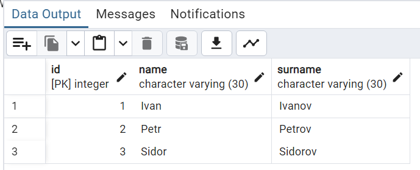

#### Таблица с заказами

1. Создание таблицы для заказов

```sql
CREATE TABLE orders (
	id SERIAL PRIMARY KEY,
	datetime TIMESTAMP,
	id_client INTEGER,
	FOREIGN KEY (id_client) REFERENCES client(id),
	status VARCHAR(30)
);

ALTER TABLE orders
ADD COLUMN comment VARCHAR(200)
```
2. Добавление экземпляров и просмотр результата

```sql
INSERT INTO orders (datetime, id_client, status) VALUES ('2020-01-01', 1, 'в обработке');

INSERT INTO orders (datetime, id_client, status) VALUES ('2020-02-06', 2, 'в обработке');

INSERT INTO orders (datetime, id_client, status) VALUES ('2020-03-08', 3, 'в обработке');

INSERT INTO orders (datetime, id_client, status, comment) VALUES ('2020-01-01', 1, 'в обработке', 'комментарий');

SELECT * FROM orders
```
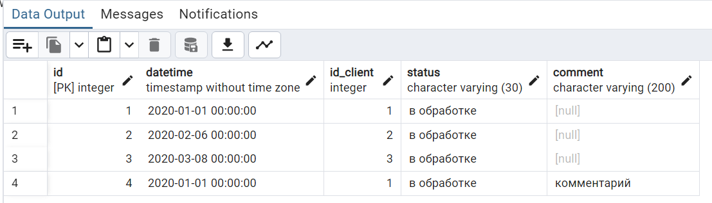

#### Таблица с позициями

1. Создание таблицы для позиций

```sql
CREATE TABLE positions (
	id SERIAL PRIMARY KEY,
	id_order INTEGER,
	id_menu INTEGER,
	FOREIGN KEY (id_order) REFERENCES orders(id),
	FOREIGN KEY (id_menu) REFERENCES menu(id),
	quantity INTEGER
)
```
2. Добавление экземпляров и просмотр результата

```sql
INSERT INTO positions (id_menu, id_order,  quantity) VALUES (6, 4, 2);

INSERT INTO positions (id_menu, id_order,  quantity) VALUES (7, 2, 1);

INSERT INTO positions (id_menu, id_order,  quantity) VALUES (8, 2, 1);

SELECT * FROM positions
```
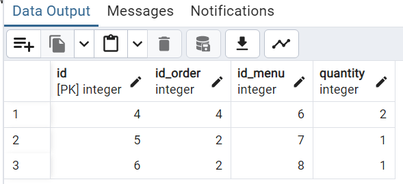

## Учебное заведение

### Таблица с объектами и атрибутами

|Таблица     | Атрибуты           | Ограничения                      |
|------------|--------------------|----------------------------------|
| студент    | id                 | только числа, авто инкремент     |
|            |имя                 |  строка не более 50 символов     |
|            | фамилия            |строка не более 50 символов       |
|            | дата роджения      |формат даты: ГГГГ-ММ-ДД           |
|            | дата зачисления    |формат даты: ГГГГ-ММ-ДД           |
|            | специальность      |строка не более 50 символов       |
|            | картинка           |двоичные данные                   |
||          ||                    ||                                ||
| курс       | id                 | только числа, авто инкремент     |
|            | название           |  строка не более 50 символов     |
|            | описание           |строка не более 250 символов      |
|            | количесво кредитов |число больше чем 0                |
|            | статус             |строка не более 50 символов       |
|            | программа          |строка не более 250 символов      |
||          ||                    ||                                ||
| зачисление | id                 | только числа, авто инкремент     |
|            | id студента        | только числа, ссылка             |
|            | id курса           | только числа, ссылка             |
|            | оценка             |число больше чем 0                |
||          ||                    ||                                ||

### ER-диаграмма учебного заведения


Зачисление не является сущностью, это соответствие курса и студента, так как между ними связь много ко многому.

Студент и курс могут существовать друг без друга.

### SQL-запросы

#### Таблица со студентами

1. Создание таблицы для студентов

```sql
CREATE TABLE students (
    id SERIAL PRIMARY KEY,
    name VARCHAR(50),
    surname VARCHAR(50),
    birth date,
    enrollment date,
    speciality VARCHAR(50)
);
```
2. Добавление экземпляров и просмотр результата

```sql
INSERT INTO students (name, surname, birth, enrollment, speciality) VALUES ('Ivan', 'Ivanov', '1990-01-01', '2020-09-01', 'math');

INSERT INTO students (name, surname, birth, enrollment, speciality) VALUES ('Petr', 'Petrov', '1970-01-01', '1990-09-01', 'geography');

INSERT INTO students (name, surname, birth, enrollment, speciality) VALUES ('Sidor', 'Sidorov', '1930-07-08', '2000-09-01', 'physics');

SELECT * FROM students
```
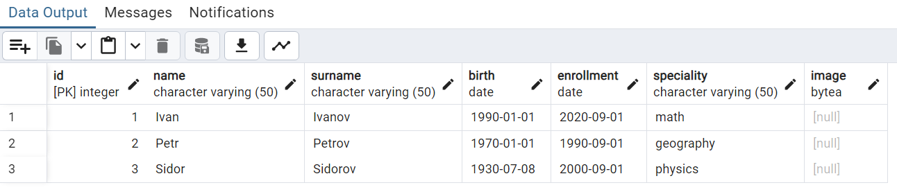

#### Таблица с курсами

1. Создание таблицы для курсов

```sql
CREATE TABLE courses (
    id SERIAL PRIMARY KEY,
    name VARCHAR(50),
    description VARCHAR(250),
    credit_quantity INTEGER,
    ststus VARCHAR(50)
);
```
2. Добавление экземпляров и просмотр результата

```sql
INSERT INTO courses (name, description, credit_quantity, ststus) VALUES ('Математика', 'Математика', 3, 'В наличии');

INSERT INTO courses (name, description, credit_quantity, ststus) VALUES ('Физика', 'Физика', 3, 'В наличии');

INSERT INTO courses (name, description, credit_quantity, ststus) VALUES ('Химия', 'Химия', 3, 'В наличии');

SELECT * FROM courses
```
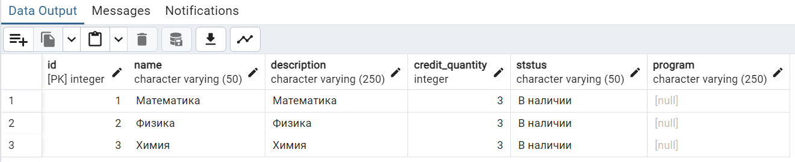

#### Таблица с зачислением

1. Создание таблицы для зачисления

```sql
CREATE TABLE enrollment (
    id SERIAL PRIMARY KEY,

    id_student INTEGER,
    FOREIGN KEY (id_student) REFERENCES students(id),

    id_course INTEGER,
    FOREIGN KEY (id_course) REFERENCES courses(id),

    mark INTEGER
);
```
2. Добавление экземпляров и просмотр результата

```sql
INSERT INTO enrollment (id_student, id_course, mark) VALUES (1, 1, 5);

INSERT INTO enrollment (id_student, id_course, mark) VALUES (2, 2, 4);

INSERT INTO enrollment (id_student, id_course, mark) VALUES (3, 3, 3);

SELECT * FROM enrollment
```
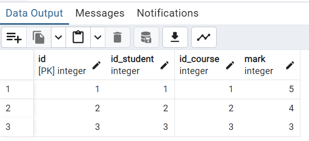

